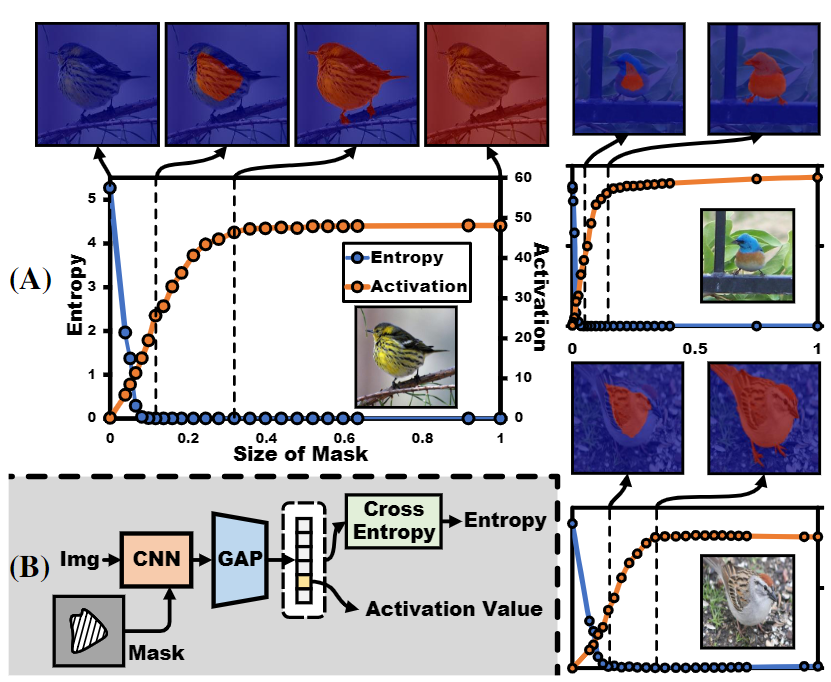
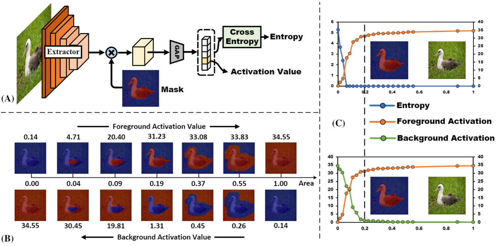
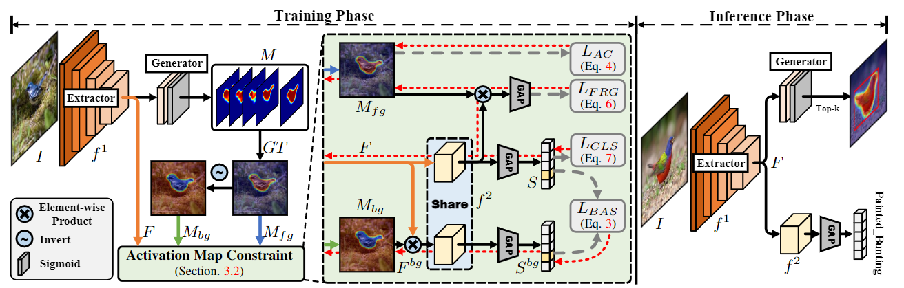
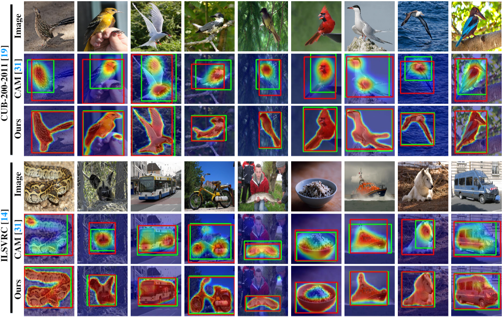
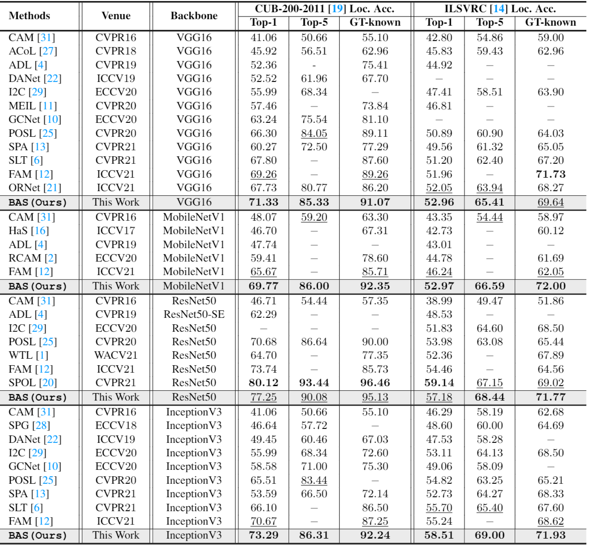

# Background Activation Suppression for Weakly Supervised Object Localization (CVPR2022)

PyTorch implementation of ''Background Activation Suppression for Weakly Supervised Object Localization''. This repository contains PyTorch training code, inference code and pretrained models.

## 📋 Table of content
 1. [📎 Paper Link](#1)
 2. [💡 Abstract](#2)
 3. [✨ Motivation](#3)
 4. [📖 Method](#4)
 5. [📃 Requirements](#5)
 6. [✏️ Usage](#6)
    1. [Start](#61)
    2. [Download Datasets](#62)
    3. [Training](#63)
    4. [Inference](#64)
 8. [📊 Experimental Results](#7)
 11. [✉️ Statement](#8)
 12. [🔍 Citation](#9)

## 📎 Paper Link <a name="1"></a> 
> Background Activation Suppression for Weakly Supervised Object Localization ([link](https://arxiv.org/pdf/2112.00580.pdf))
* Authors: Pingyu Wu*, Wei Zhai*, Yang Cao
* Institution: University of Science and Technology of China (USTC)

## 💡 Abstract <a name="2"></a> 
Weakly supervised object localization (WSOL) aims to localize objects using only image-level labels. Recently a new paradigm has emerged by generating a foreground prediction map (FPM) to achieve localization task. Existing FPM-based methods use cross-entropy (CE) to evaluate the foreground prediction map and to guide the learning of generator. We argue for using activation value to achieve more efficient learning. It is based on the experimental observation that, for a trained network, CE converges to zero when the foreground mask covers only part of the object region. While activation value increases until the mask expands to the object boundary, which indicates that more object areas can be learned by using activation value. In this paper, we propose a Background Activation Suppression (BAS) method. Specifically, an Activation Map Constraint module (AMC) is designed to facilitate the learning of generator by suppressing the background activation value. Meanwhile, by using the foreground region guidance and the area constraint, BAS can learn the whole region of the object. In the inference phase, we consider the prediction maps of different categories together to obtain the final localization results. Extensive experiments show that BAS achieves significant and consistent improvement over the baseline methods on the CUB-200-2011 and ILSVRC datasets. Code and models are available at https://github.com/wpy1999/BAS.

## ✨ Motivation <a name="3"></a> 

<p align="center">
     <br />
    <em> 
    </em>
</p>

**Motivation.** (A) The entroy value of CE loss $w.r.t$ foreground mask and foreground activation value $w.r.t$ foreground mask. To illustrate the generality of this phenomenon, more examples are shown in the subfigure on the right. (B) Experimental procedure and related definitions. Implementation details of the experiment and further results are available in the Supplementary Material.

### Exploratory Experiment

We introduce the implementation of the experiment, as shown in Fig. \ref{Exploratory Experiment} (A). For a given GT binary mask, the activation value (Activation) and cross-entropy (Entropy) corresponding to this mask are generated by masking the feature map. We erode and dilate the ground-truth mask with a convolution of kernel size $5n \times 5n$, obtain foreground masks with different area sizes by changing the value of $n$, and plot the activation value versus cross-entropy with the area as the horizontal axis, as shown in Fig. \ref{Exploratory Experiment} (B). By inverting the foreground mask, the corresponding background activation values for the foreground mask area are generated in the same way. In Fig. \ref{Exploratory Experiment} (C), we show the curves of entropy, foreground activation, and background activation with mask area. It can be noticed that both background activation and foreground activation values have a higher correlation with the mask compared to the entropy. We show more examples in the Supplementary Material.

<p align="center">
     <br />
    <em> 
    </em>
</p>

**Exploratory Experiment.** Examples about the entroy value of CE loss $w.r.t$ foreground mask and foreground activation value $w.r.t$ foreground mask.

## 📖 Method <a name="4"></a> 

<p align="center">
     <br />
    <em> 
    </em>
</p>

**The architecture of the proposed BAS.** In the training phase, the class-specific foreground prediction map $F^{fg}$ and the coupled background prediction map $F^{bg}$ are obtained by the generator, and then fed into the activation map constraint module together with the feature map $F$. In the inference phase, we utilize Top-k to generate the final localization map.

## 📃 Requirements <a name="5"></a> 
  - python 3.6.10 
  - torch 1.4.0
  - torchvision 0.5.0
  - opencv 4.5.3

## ✏️ Usage <a name="6"></a> 

### Start <a name="61"></a> 

```bash  
git clone https://github.com/wpy1999/BAS.git
cd BAS
```

### Download Datasets <a name="62"></a> 

* CUB ([http://www.vision.caltech.edu/visipedia/CUB-200-2011.html](http://www.vision.caltech.edu/visipedia/CUB-200-2011.html))
* ILSVRC ([https://www.image-net.org/challenges/LSVRC/](https://www.image-net.org/challenges/LSVRC/))

### Training <a name="63"></a> 

```
python train.py --arch ${Backbone}
```

### Inference <a name="64"></a> 

To test the CUB models, you can download the trained models from
[ [Google Drive (VGG16)]( https://drive.google.com/file/d/1c3okqQWJNEv-riAuEKzm9pFAvMtm6ISk/view?usp=sharing) ],
[ [Google Drive (Mobilenetv1)]( https://drive.google.com/file/d/1_i1XEO9bSlietnrgFnVoBlOaRGhPnPh2/view?usp=sharing) ],
[ [Google Drive (ResNet50)](https://drive.google.com/file/d/13qPalet2zTRosFz9PJOP1GrLYyEb4NNF/view?usp=sharing) ],
[ [Google Drive (Inceptionv3)](https://drive.google.com/file/d/1hZOjU5kqpdZZK1WO-bi5zICPpFj6Bi7d/view?usp=sharing) ],
then run `BAS_inference.py`:
```bash  
cd CUB
python BAS_inference.py --arch ${Backbone}
```

To test the ILSVRC models, you can download the trained models from
[ [Google Drive (VGG16)]( https://drive.google.com/file/d/1BSaHxXnK0o-zem9IadrbwqafZnJQt8De/view?usp=sharing) ],
[ [Google Drive (Mobilenetv1)]( https://drive.google.com/file/d/13MSMH_bzSBXVmNoc0MnFb2pQI0ePquhD/view?usp=sharing) ],
[ [Google Drive (ResNet50)](https://drive.google.com/file/d/1Zmu1IGPy9lp5PfhC2u_jAcwt1nouRnTb/view?usp=sharing) ],
[ [Google Drive (Inceptionv3)](https://drive.google.com/file/d/1xq9AOS-vxGtDVBqDvggANlyQuraS6_Is/view?usp=sharing) ],
then run `BAS_inference.py`:
```bash  
cd ILSVRC
python BAS_inference.py --arch ${Backbone}
```

## 📊 Experimental Results <a name="7"></a> 


<p align="center">
     <br />
    <em> 
    </em>
</p>

<p align="center">
     <br />
    <em> 
    </em>
</p>

## ✉️ Statement <a name="8"></a> 
This project is for research purpose only, please contact us for the licence of commercial use. For any other questions please contact [wpy364755620@mail.ustc.edu.cn](wpy364755620@mail.ustc.edu.cn) or [wzhai056@mail.ustc.edu.cn](wzhai056@mail.ustc.edu.cn).


## 🔍 Citation <a name="9"></a> 

```
@inproceedings{BAS,
  title={Background Activation Suppression for Weakly Supervised Object Localization},
  author={Pingyu Wu and Wei Zhai and Yang Cao},
  journal={arXiv preprint arXiv:2112.00580},
  year={2021}
}
```

